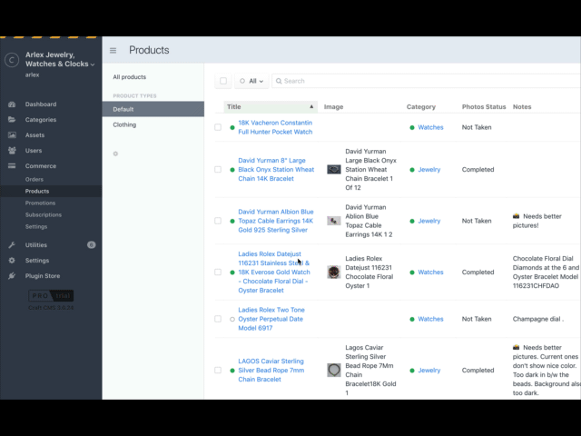

# Collapse CP Nav plugin for Craft CMS 3.x
Take control of the left pane navigation in the admin.  Use this plugin to free up more screen real estate by hiding the CP's left pane. Especially handy when working on entries listings with many columns.

_**Note:** The license fee for this plugin is $9 via the Craft Plugin Store._

## Requirements
This plugin requires Craft CMS 3.0.0-RC1 or later.

## Installation
### Composer
To install the plugin, follow these steps:

1. Install with Composer via:
   `composer require eaglepeak/collapse-cp-nav`

3. In the Control Panel, go to Settings → Plugins and click the “Install” button for Collapse CP Nav.

### Craft Plugin Store
You can also install SEOmatic via the **Plugin Store** in the Craft AdminCP.

## Using Collapse CP Nav
Once installed, a persistent **☰** hamburger menu will appear at the top of the control panel. When you need more desktop space on the admin screens click the **☰** icon to hide the left navigation pane.

## Issues
Please report any issues you find to the [Collapse CP Nav issues](https://github.com/EaglePeak/craft-collapse-cp-nav/issues) page.

## Collapse CP Nav Roadmap
Some things to do & ideas for potential features:

* _TBD_ we're open to suggestions.

Brought to you by [EaglePeak Consulting](https://www.eaglepeakweb.com/)
